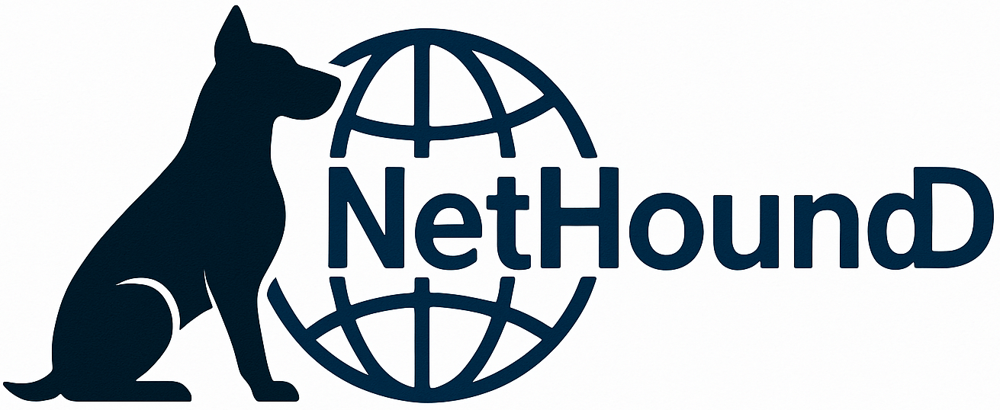

<p align="center">
  
</p>

# NetHound - Advanced Network Scanning and Visualization Dashboard

NetHound is a comprehensive network security tool divided into two main components:

1. **Network Ingestor**:
   - A collection of powerful scanning scripts with a user-friendly GUI interface
   - Combines RustScan's fast port discovery with Nmap's detailed analysis
   - Fetches vulnerability information from various databases
   - Saves scan results and vulnerability data in structured JSON format
   - Makes complex network scanning accessible through an intuitive interface

2. **Visualization Dashboard**:
   - A Django-based web application
   - Presents comprehensive scan results and vulnerability information
   - Provides interactive visualizations of network topology
   - Offers detailed analysis of discovered services and vulnerabilities
   - Enables easy comparison between different scans

The two components work together seamlessly: the Ingestor performs the scanning and data collection, while the Dashboard provides an elegant and intuitive way to analyze and understand the results.

## 🚀 Features

- **User-Friendly GUI Interface**
  - Interactive scanning configuration
  - Target specification with CIDR support
  - Customizable scan options
  - Real-time scan progress monitoring
  - History tracking for targets and output directories

- **Advanced Scanning Capabilities**
  - RustScan integration for fast port discovery
  - Comprehensive Nmap scanning options
  - Version detection (-sV)
  - SYN scan (-sS)
  - TCP connect scan (-sT)
  - UDP scan (-sU)
  - OS detection (-O)
  - Aggressive scan (-A)
  - Custom timing templates (-T4)

- **Visualization Dashboard**
  - Interactive network topology visualization
  - Port state analysis
  - Service version information
  - Host details and statistics
  - CVE vulnerability reporting
  - Scan comparison (NDiff)

## 📋 Prerequisites

### System Requirements
- Python 3.13+
- RustScan
- Nmap
- Docker (for running the Dashboard)

### Requirements Files
- `ingestor_requirements.txt`: Required for running the Network Scanner on host machine
- `requirements.txt`: Only needed if you want to run the Dashboard without Docker

## 🛠️ Installation

NetHound is designed with a split architecture:
- The Ingestor runs on the host machine for direct network access and better performance
- The Dashboard typically runs in Docker for easy deployment and isolation

first make the output directory
### Recommended Setup (Default)

1. Navigate to the /opt directory and clone the repository:
```bash
cd /opt
sudo git clone https://github.com/omrankhd/NetHound.git nethounddashboard
cd nethounddashboard
```

2. Install Ingestor requirements on the host:
```bash
pip install -r ingestor_requirements.txt
```

3. Set proper permissions:
```bash
sudo chown -R $USER:$USER /opt/nethounddashboard
sudo chmod -R 755 /opt/nethounddashboard
```

4. Run the Dashboard using Docker:
```bash
# Build the Docker image
docker build -t nethound .

# Run the container
docker run -d \
  -p 8000:8000 \
  -v /opt/xml:/opt/xml \
  --name nethound \
  nethound
```

The Dashboard will be available at `http://localhost:8000`

> **Not Recommended:** If you want to run the Ingestor inside Docker (this may have display issues):
> 
> ⚠️ First, you need to allow Docker to access X server (WARNING: This is not secure!):
```bash
xhost +local:docker  # WARNING: This reduces X server security!
```
> Then run the container:
```bash
sudo docker run -d \
  -v /opt/xml:/opt/xml \
  -e DISPLAY=$DISPLAY \
  --net=host \
  --name nethound \
  nethound
```
> Note: This approach is not recommended for security and performance reasons. Prefer running the Ingestor directly on the host machine.

### Alternative Setup (Without Docker)

If you prefer to run everything on the host machine (not recommended):

1. Install full requirements:
```bash
pip install -r requirements.txt
```

2. Start the Django server:
```bash
python manage.py runserver
```

3. Access the dashboard at `http://localhost:8000`

3. Navigate through different views:
   - Host Details
   - Port Information
   - Service Analysis
   - Network Topology
   - Vulnerability Reports
   - Scan Comparisons

Note: Running the Dashboard directly on the host machine is not recommended as it requires additional configuration and may have dependency conflicts.


## �🚦 Usage

### Network Scanning (Host Machine)

1. Launch the GUI scanner:
```bash
sudo python gui.py
```

2. Configure scan settings:
   - Enter target IP/CIDR (e.g., 192.168.1.0/24)
   - Select desired scan options
   - Choose output directory within `/opt/xml/`
   - Configure port settings (Top ports or custom range)

3. Click "Run Scan" to start the scanning process

The scan results will be automatically saved to `/opt/xml/` and can be viewed in the Dashboard.

### Dashboard Access

The Dashboard will be available at `http://localhost:8000` after starting the Docker container. 
Log in with your configured credentials (default: admin/admin) to view scan results.

## 📊 Project Structure

### Network Ingestor Component
The Ingestor is responsible for network scanning and vulnerability data collection:

- **gui.py**: Main graphical interface for scan configuration
- **ingestor/**: Core scanning components
  - `rustIngestor.py`: RustScan integration for fast port discovery
  - `cvecollector.py`: Fetches and processes vulnerability data from various databases

- **vuln_checkers/**: Service-specific vulnerability scanners
  - `check_dns.py`: DNS service vulnerability checks
  - `check_ftp.py`: FTP service vulnerability checks
  - `check_smb.py`: SMB service vulnerability checks
  - `check_smtp.py`: SMTP service vulnerability checks
  - `check_telnet.py`: Telnet service vulnerability checks
  - `vulnerability_scanner.py`: Core vulnerability scanning logic

### Dashboard Component
The Dashboard is a Django web application for visualizing and analyzing scan results:

- **nethoundreport/**: Core dashboard application
  - `views.py`: Main dashboard views and data processing
  - `network.py`: Network topology visualization
  - `api.py`: REST API endpoints for data access
  - `models.py`: Data models for scan results
  - `functions.py`: Utility functions for data processing
  - `ndiff.py`: Scan comparison functionality
  - `templates/`: HTML templates for the web interface
  - `static/`: CSS, JavaScript, and image assets

## 🔐 Security Features

- Authentication system for dashboard access
- Sanitized input handling
- Secure output directory management
- CVE tracking and reporting
- Service-specific vulnerability checks

## 📁 Output Structure

Scans are stored in `/opt/xml/` with the following structure:
- XML output from Nmap scans
- JSON files containing CVE information


## 🔗 Additional Resources

- [Nmap Documentation](https://nmap.org/docs.html)
- [RustScan Documentation](https://github.com/RustScan/RustScan)
- [Django Documentation](https://docs.djangoproject.com/)

## ⚠️ Disclaimer

This tool is intended for legitimate security testing and network administration purposes only. Users are responsible for complying with applicable laws and regulations.
